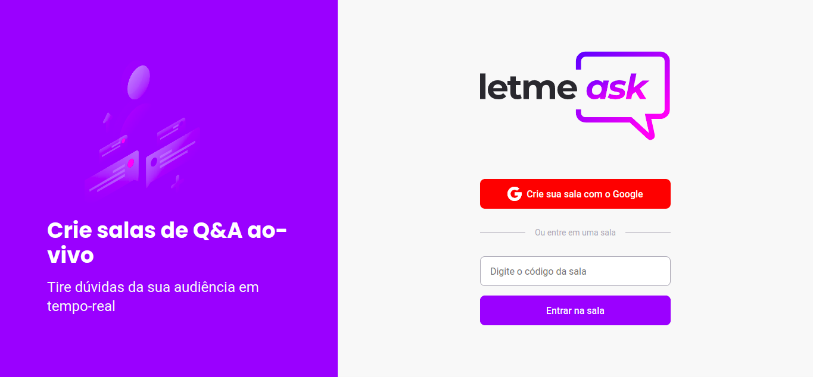
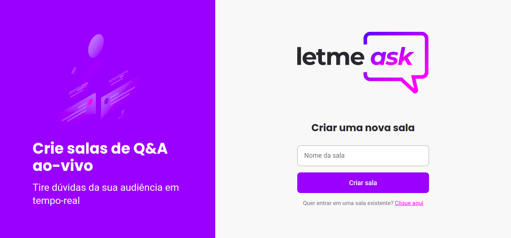
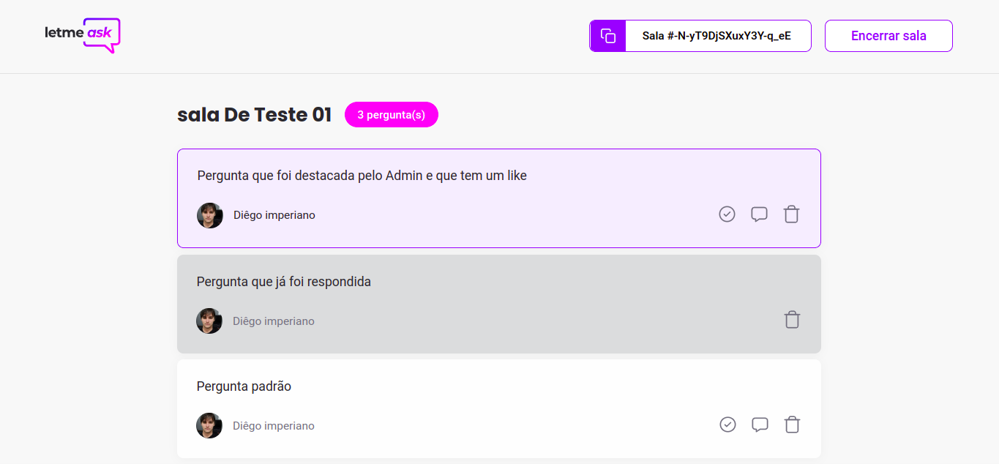
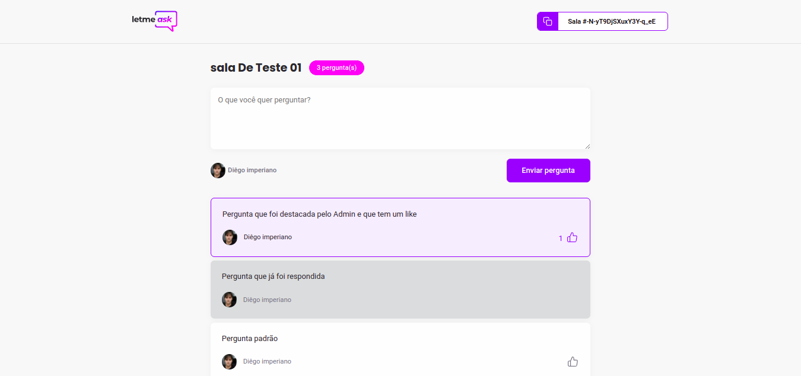

<p align="center">
  
</p>

<p align="center">
  <a href="#sobre">Sobre</a>&nbsp;&nbsp;&nbsp;|&nbsp;&nbsp;&nbsp;
  <a href="#🧪-tecnologias-utilizadas">Tecnologias utilizadas</a>&nbsp;&nbsp;&nbsp;|&nbsp;&nbsp;&nbsp;
  <a href="#🚀-como-executar">Como executar</a>&nbsp;&nbsp;&nbsp;|&nbsp;&nbsp;&nbsp;
  <a href="#📝-Licença-e-autor">Licença e autor</a>
</p>

## Sobre

Letmeask é perfeito para criadores de conteúdos poderem criar salas de Q&A com o seu público, de uma forma muito organizada e democrática.

Este é um projeto desenvolvido durante a **[Next Level Week Together](https://nextlevelweek.com/)**, apresentada dos dias 20 a 27 de Junho de 2021.

### Algumas telas da versão de desktop

<p align="center">

_Tela de acessar sala:_


_Tela de criar sala:_


_Visão do Admin:_


_Visão do úsuario comum:_


</p>

## 🧪 Tecnologias utilizadas

Este projeto foi desenvolvido utilizando as seguintes tecnologias:

- [Firebase](https://firebase.google.com/)

### 💻 Front-end

- [React](https://reactjs.org)
- [TypeScript](https://www.typescriptlang.org/)

## 🚀 Como executar

Clone o projeto e acesse a pasta do mesmo.

```bash
$ git clone git@github.com:DiegoImperiano/letme-ask.git
$ cd letme-ask
```

Para iniciá-lo, siga os passos abaixo:

```bash
# Instalar as dependências
$ yarn
# Iniciar o projeto
$ yarn start
```

O app estará disponível no seu browser pelo endereço http://localhost:3000.

Lembrando que será necessário criar uma conta no [Firebase](https://firebase.google.com/) e um projeto para disponibilizar um Realtime Database.

## To do

Algumas ideias para melhorar a aplicação:

- Adicionar um tema dark.

Sinta-se livre para sugerir novas melhorias e correções [criando uma issue](https://github.com/DiegoImperiano/letme-ask/issues/new) 😉.

## 📝 Licença e autor

Este projeto está sob a licença MIT. Veja o arquivo [LICENSE](https://github.com/DiegoImperiano/letme-ask/blob/main/LICENSE) para mais detalhes.

Desenvolvido por [Diego Imperiano](https://github.com/DiegoImperiano).

[](https://www.linkedin.com/in/diegoimperiano/)
